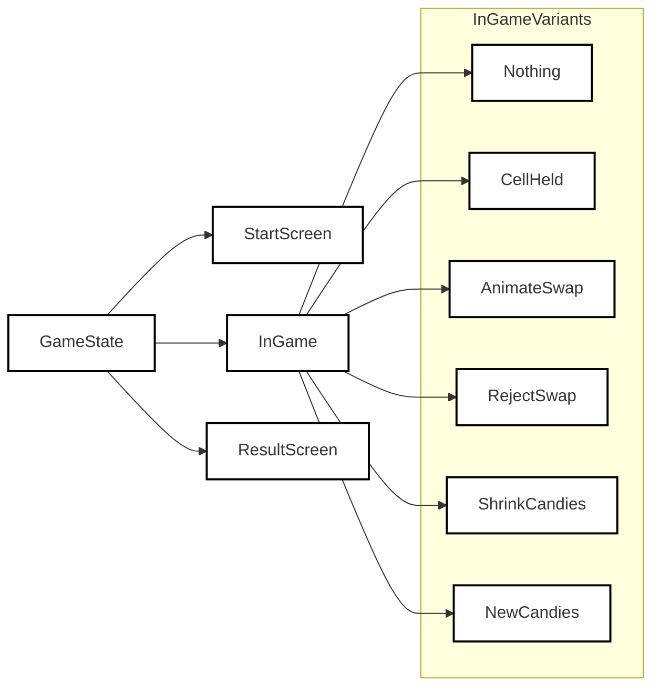
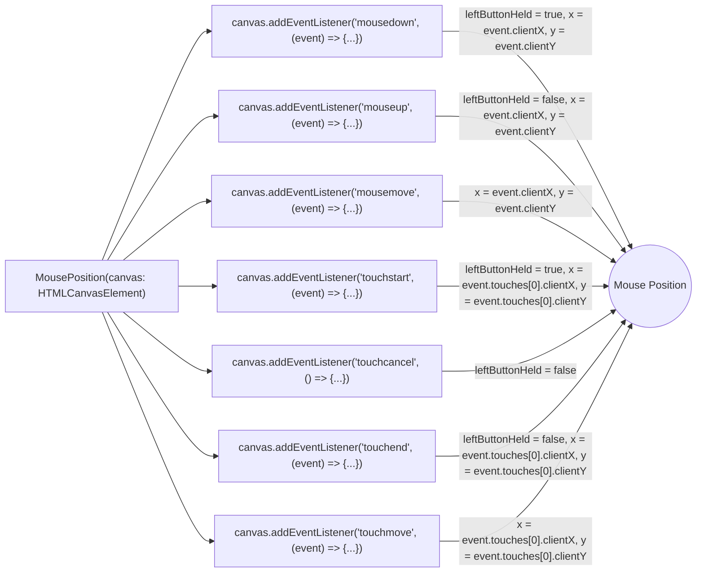

# Candy Crush Clone

This is a clone of the popular game "Candy Crush" implemented using HTML5 canvas, TypeScript, and OOP principles.

[Play now!](https://cheery-bublanina-f00bde.netlify.app)

## Game Rules

The game follows the same basic rules as Candy Crush, but with some limitations. The player needs to swap adjacent candies to create a row or column of three or more candies of the same type. When this happens, those candies disappear, and new ones fall from the top to fill the gaps. The game ends when the player runs out of time.

## Technologies Used

This game is built using HTML5 canvas, TypeScript, and OOP principles. The state transitions are managed using discriminated unions, and animations are managed using linear interpolation. The game is built using Vite as a build tool, and the server can be run using the command `npm run dev`. The game can be played at `localhost:5173`.

## Drag and Drop Feature

To move a candy, the player needs to drag and drop it to the desired location. The state of the game changes depending on the user's actions. When the user holds a cell and drags it to another cell, the two cells are swapped, and the game state transitions back to "nothing." However, the user must release the mouse to perform a new swap.

## State Transitions

The game state is managed using discriminated unions. Each possible state is represented by a type with a unique "type" string. For example, the "nothing" state has a type of "nothing". This makes it easier to handle game logic and animation.

## Animations

Animations in the game are managed using linear interpolation. When the state of the game changes, the game calculates the amount of time that has passed since the state change and updates the animation accordingly. This creates smooth animations that reflect the current state of the game.

The component of the game that deals with drawing the falling candies on the game board takes in the current board state, the new candies that will fall, and the progress of the animation as input. It first creates a "stubbed" version of the board and new candies, where each candy is given a unique ID. It then calculates the new position of each candy after it falls and stores it in an array. It also stores the old position of each candy in another array. The component then draws a grid on the game board, representing the background. It then uses interpolation to smoothly animate the movement of each candy from its old position to its new position, drawing each candy at its interpolated location.

## Build Tool

The game is built using Vite, a fast and lightweight build tool. To run the server, use the command `npm run dev`. The game can then be played at `localhost:5173`.

## Diagrams

## Design Patterns

This game uses many design patterns to organize the code.

[**GameState**](src/GameState.ts)

- **Discriminated union**: Differentiate between many different states in the game. The TypeScript language automatically checks for potential violations through deep analyses of the code. This TypeScript feature is a combination of the powerful inheritance and polymorphism design patterns.

[**LeaderboardManager**](src/LeaderboardManager.ts)

- **Adapter pattern**: We have an interface `StorageAdapter` and a concrete implementation `LocalStorageAdapter` that adapts the localStorage API to be used in the `LeaderboardManager` class. This allows for easy replacement of the storage mechanism if needed.
- **Encapsulation**: The `LeaderboardManager` class encapsulates the logic related to managing the leaderboard, separating it from the rest of the application.
- **Composition**: The `LeaderboardManager` class has a `StorageAdapter` instance that it uses for saving and loading scores. This is an example of composition, as the `LeaderboardManager` doesn't inherit from the `StorageAdapter`, but rather has a reference to an instance of it.
- **Simple Factory**: The `LeaderboardManager` class has a default value for its `storageAdapter` parameter, which is an instance of `LocalStorageAdapter`. This is a simple example of the factory pattern, where the class creates a default instance of an object if none is provided.

[**MousePosition**](src/MousePosition.ts)

- The `IEventHandler` interface is used to define a common structure for event handling classes.
- The `MouseEventHandler` and `TouchEventHandler` classes implement the `IEventHandler` interface, demonstrating the **Strategy pattern**.
- The `MouseButtonHandler` is an abstract class that defines the structure for handling mouse button events, with the `MouseDownHandler` and `MouseUpHandler` classes extending it, demonstrating the **Template Method pattern**.
- The `MousePosition` class now uses instances of these handler classes and delegates the event handling to them, demonstrating the **Delegation pattern**.

[**DetectCell**](src/DetectCell.ts)

- **Builder pattern**: `DetectCellBuilder` constructs the `DetectCell` objects in a step-by-step manner.
- **Dependency Injection pattern**: Instead of setting properties directly in the `DetectCell` class, a separate `DetectCellConfig` class stores the configuration, which is then passed to the `DetectCell` class.

## Conclusion

This clone of Candy Crush demonstrates how HTML5 canvas, TypeScript, and OOP principles can be used to create a simple game. By managing the game state using discriminated unions and using linear interpolation for animations, the game provides a smooth and engaging experience for players.
