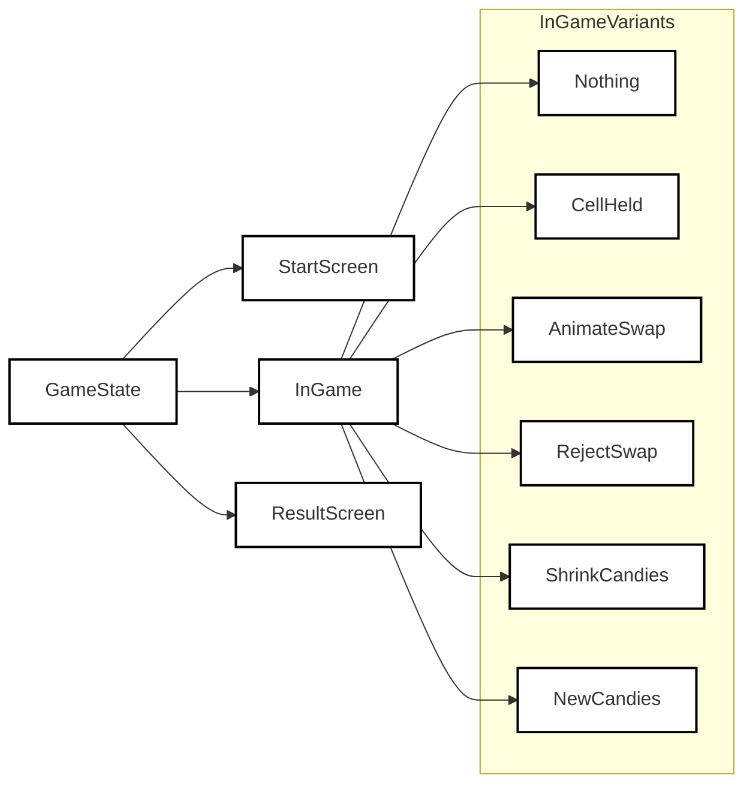
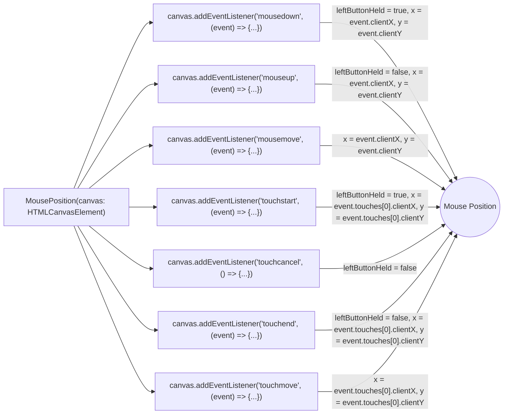

# Crusgkeo

This is a clone of the popular game "Candy Crush" implemented using HTML5 canvas, TypeScript, and OOP principles.

[Play now!](https://cheery-bublanina-f00bde.netlify.app)

## Game Rules

The game follows the same basic rules as Candy Crush, but with some limitations. The player needs to swap adjacent candies to create a row or column of three or more candies of the same type. When this happens, those candies disappear, and new ones fall from the top to fill the gaps. The game ends when the player runs out of time.

## Technologies Used

This game is built using HTML5 canvas, TypeScript, and OOP principles. The state transitions are managed using discriminated unions, and animations are managed using linear interpolation. The game is built using Vite as a build tool, and the server can be run using the command `npm run dev`. The game can be played at `localhost:5173`.

## Development Workflow

As a collaborative project, the enforcement of proper coding style is very important. The "Prettify Code" workflow ensures consistent code formatting by automatically running Prettier on every push to the main branch. This GitHub Actions workflow operates on latest Ubuntu and requires write access to the repository contents. The job consists of several steps: checking out the code, setting up Node.js with the latest version, installing dependencies, and finally running Prettier to format the code. The Prettier options are set to write the formatted changes directly to the repository, ensuring that all contributors adhere to the established coding style and maintain a clean, readable codebase.

In addition to the automated code formatting, the project benefits from seamless integration with Netlify, a robust platform for deploying web applications. With this integration, the application build process is automatically managed by Vite, a next-generation build tool optimized for speed and ease of use. Once the build is successfully completed, Netlify effortlessly publishes the updated content to the live website without any human intervention required. This automated pipeline ensures a smooth and efficient deployment workflow for the development team. Furthermore, in the case of any build errors, Netlify ensures that clear and adequate information is sent to the development team, enabling them to identify and resolve the issues promptly, maintaining a high level of application reliability and stability.

Repository protection plays a critical role in ensuring the security and integrity of project files. To prevent malicious activities and accidental modifications, the repository settings prohibit force pushing, which allows for the reversal of mistakes should they occur. This protection measure is enforced by GitHub and cannot be circumvented, ensuring that the codebase remains safe and stable. The only exception to this rule is if the repository owner explicitly disables the protection; however, such a situation has never arisen, as there are no justifiable reasons to do so. By enforcing these safety measures, the project maintains a high level of security and data consistency, allowing the development team to work together confidently and efficiently.

## Drag and Drop Feature

To move a candy, the player needs to drag and drop it to the desired location. The state of the game changes depending on the user's actions. When the user holds a cell and drags it to another cell, the two cells are swapped, and the game state transitions back to "nothing." However, the user must release the mouse to perform a new swap.

## State Transitions

The game state is managed using discriminated unions. Each possible state is represented by a type with a unique "type" string. For example, the "nothing" state has a type of "nothing". This makes it easier to handle game logic and animation.

State transitions play a crucial role in managing the flow of any application or game. The workflow of state transitions is the sequence of different states that an application or game goes through when various events occur.

GameStateManager class has been defined with a state attribute which is an instance of the GameState type. Types such as StartScreen, InGame, and ResultScreen represent different states or screens the game can be in, along with various other subtypes used for handling animations, fading, or candy movement events.

The GameStateManager class has methods to handle different game events and transition the game state based on the current state and event. Below is a brief overview of different methods and the workflow of state transitions.

1. displayStartScreen(): This method is used to start the game by setting the game state to 'start screen'.
2. fadeStartScreen(timeOrigin): This method is used to fade the start screen away based on the given timeOrigin indicating start of animation.
3. displayGame(timeOrigin): This method initializes the board state with a new board and transitions the game state to the 'nothing' sub-state of InGame type.
4. fadeGame(timeOrigin): Fades the game screen based on the given timeOrigin.
5. showResult(): Transitions the game state to 'result screen' to show the game score.
6. fadeResult(timeOrigin): Fades the result screen away based on the given timeOrigin indicating start of animation.
7. holdOutsideBoard(): Handles the event when the cursor is clicked and held outside the board, making necessary state transitions accordingly.
8. holdCell(row, column, timeOrigin): Handles the event of holding a cell on the board, followed by the necessary state transitions based on the current game state.
9. releaseMouse(): Handles the event of releasing the mouse, making the necessary state transitions accordingly.
10. completeSwap(animationTimeOrigin): Handles the event of swapping two cell candies on the board and checks whether the swap is legal or not based on the game rules. If legal, it transitions to the 'shrink candies' sub-state; otherwise, it returns to the 'nothing' sub-state.
11. completeShrink(animationTimeOrigin): Handles the event of shrinking matched candies, generates new candies, and transitions the game state to the 'new candies' sub-state.
12. completeFall(animationTimeOrigin): Handles the event of dropping new candies into blank cells resulting from matched candies. If more matches are found, the state transitions back to 'shrink candies'; otherwise, it transitions to the 'nothing' sub-state.

The workflow of state transitions is designed in such a way that it updates the game state and board as new events are encountered. For instance, when the player holds and drags a cell to another cell, the two cells are swapped, and the game state transitions back to the 'nothing' state. However, this does not mean that when the player continues moving the cursor, the game should continue swapping immediately. Instead, the player must release the mouse to perform a new swap.

The state transition workflow is significant in maintaining the game logic, smooth rendering of various animations, and determining the legal moves according to the game rules.

## Game Board

The game features a variety of candy objects identified by their shapes and attributes. The shape of the candies can be circle, square, or diamond.

The game board consists of a two-dimensional grid or matrix formed by rows and columns containing candies. A board with blanks is a variation of the main board where some positions are null, indicating the absence of candies in those positions.

The code further includes a function to check if there are any matches on the board. The implementation of the function looks for any configurations where there are three or more candies of the same type in a row or column. It uses a helper function that checks if there are three items of a particular type in a line. The function also has the ability to transpose the board for ease of comparison when searching for matches.

To create a game board, there are two functions available. The first generates a board of any configuration with a given width and height, randomly assigning the type and attribute of candies to each position. The second function, however, ensures that the generated board has no matches by repeatedly generating new boards until a suitable one is found. This function can be slow for large boards, as it continually looks for a suitable configuration.

Blanking all matches is a necessary game mechanic when a match is found. As matches are found, the candies involved in the match are removed or turned into blanks. A provided function does this by inspecting the board and updating the positions where matches are detected to be null.

Once the matches have been removed, new candies must be introduced to the board. This is performed using two functions that generate new candies and insert them into the appropriate positions on the board. The first function generates the new candies, while the second function handles inserting these candies into the board by transposing the board and making space for the new candies.

Finally, there is a function that extracts the positions of the candies that will be blanked or removed when matches are found. It does this by iterating through the board and marking positions where consecutive candies of the same type exist in a row or column. This information is returned as a function that can verify if a certain position has been marked or not.

## Animations

Animations in the game are managed using linear interpolation. When the state of the game changes, the game calculates the amount of time that has passed since the state change and updates the animation accordingly. This creates smooth animations that reflect the current state of the game.

The component of the game that deals with drawing the falling candies on the game board takes in the current board state, the new candies that will fall, and the progress of the animation as input. It first creates a "stubbed" version of the board and new candies, where each candy is given a unique ID. It then calculates the new position of each candy after it falls and stores it in an array. It also stores the old position of each candy in another array. The component then draws a grid on the game board, representing the background. It then uses interpolation to smoothly animate the movement of each candy from its old position to its new position, drawing each candy at its interpolated location.

The following section contains more details about how animations and other game elements are drawn on the screen.

## Game Display

There is a class responsible for drawing a game board using the provided input parameters. The game board contains different kinds of candy cells with various shapes, colors, and attributes. The primary purpose of this class is to handle the rendering of the board, along with animating the various actions like swapping, falling, highlight cells, and displaying scores and remaining time.

The class has a constructor that accepts several parameters that define the size and appearance of the game board. These parameters include width, height, cell width, row count, column count, shape size, and the 2D rendering context for drawing on a canvas.

The class starts by defining several private variables, such as width, height, cell width, row count, column count, shape size, and rendering context, to keep track of the input parameters.

Then, it defines several private methods to perform internal tasks such as clearing the board, interpolating values during animation, calculating real coordinates based on row and column values, and drawing individual candy cells.

To draw the candy cells, it utilizes the DrawShapes class, which is responsible for rendering various shapes like circles, squares and diamonds.

Next, the class exposes several public methods, which can be used to perform various actions on the game board. Some of these methods are:

1. drawBoard: This method accepts a board as input and an optional special action parameter. It starts by clearing the current board and renders the board background. Depending on the special action provided, it iterates through all the cells of the board, ignoring cells if necessary, and draws candies using the private drawCandy method.

2. highlightCell: This method accepts row and column values to indicate which cell to highlight. It calculates the real coordinates of the cell and draws a border around it.

3. displayPartialSwap: This method is responsible for animating the swapping of two candies. It accepts parameters for two candies to be swapped and their row and column values. It interpolates the animation progress and draws the candies at their respective positions as they swap.

4. drawPartialFall: This method handles animating the falling of candies when empty cells are created. It accepts the board with blanks, new candies, and animation progress. It initializes arrays for both the old and new positions of the candies and calculates the interpolation of the candies based on the animation progress. The candies are then drawn in their interpolated positions.

5. displayScore: This method displays the current score on the board. It accepts the score value and renders the text on the board.

6. displayTime: This method displays the remaining time on the board. It accepts the time in seconds, calculates text rendering locations, and renders the text on the board.

The main purpose of the DrawBoard class is to visualize the game board and provide a means to animate various actions that occur during the gameplay. It achieves this by leveraging private methods for rendering individual elements and public methods for orchestrating high-level actions.

## Build Tool

The game is built using Vite, a fast and lightweight build tool. To run the server, use the command `npm run dev`. The game can then be played at `localhost:5173`.

## Diagrams

## Design Patterns

_This section serves to assist the grader in examining this homework project._

This game uses many design patterns to organize the code.

[**GameState**](src/GameState.ts)

- **Discriminated union**: Differentiate between many different states in the game. The TypeScript language automatically checks for potential violations through deep analyses of the code. This TypeScript feature is a combination of the powerful inheritance and polymorphism design patterns.

[**LeaderboardManager**](src/LeaderboardManager.ts)

- **Adapter pattern**: We have an interface `StorageAdapter` and a concrete implementation `LocalStorageAdapter` that adapts the localStorage API to be used in the `LeaderboardManager` class. This allows for easy replacement of the storage mechanism if needed.
- **Encapsulation**: The `LeaderboardManager` class encapsulates the logic related to managing the leaderboard, separating it from the rest of the application.
- **Composition**: The `LeaderboardManager` class has a `StorageAdapter` instance that it uses for saving and loading scores. This is an example of composition, as the `LeaderboardManager` doesn't inherit from the `StorageAdapter`, but rather has a reference to an instance of it.
- **Simple Factory**: The `LeaderboardManager` class has a default value for its `storageAdapter` parameter, which is an instance of `LocalStorageAdapter`. This is a simple example of the factory pattern, where the class creates a default instance of an object if none is provided.

[**MousePosition**](src/MousePosition.ts)

- The `IEventHandler` interface is used to define a common structure for event handling classes.
- The `MouseEventHandler` and `TouchEventHandler` classes implement the `IEventHandler` interface, demonstrating the **Strategy pattern**.
- The `MouseButtonHandler` is an abstract class that defines the structure for handling mouse button events, with the `MouseDownHandler` and `MouseUpHandler` classes extending it, demonstrating the **Template Method pattern**.
- The `MousePosition` class now uses instances of these handler classes and delegates the event handling to them, demonstrating the **Delegation pattern**.

[**DetectCell**](src/DetectCell.ts)

- **Builder pattern**: `DetectCellBuilder` constructs the `DetectCell` objects in a step-by-step manner.
- **Dependency Injection pattern**: Instead of setting properties directly in the `DetectCell` class, a separate `DetectCellConfig` class stores the configuration, which is then passed to the `DetectCell` class.

## Feature Rundown

_This section serves to assist the grader in examining this homework project._

- **Start screen**: Requests the user to tap to play.
- **Timer**: The game is timed. The user has to maximize their score in 30 seconds.
- **Result screen**: The user gets to see how well they did and can start the game again.
- **Candy swap animation**: The swap can be rejected or accepted, depending on whether the swap creates new matches or not.
- **Candy shrink animation**: As candies match, they shrink and disappear.
- **Candy fall animation**: As candies disappear, they leave holes on the board. New candies from the top combined with existing candies above the holes fall down to fill the holes.
- **Vibration**: As candies are cleared, the device vibrates. Support depends on browser and device type.
- **Leaderboard**: Displays top 10 scores.
- **Leave confirmation**: Mistakes happen. Users may accidentally navigate away from the website during the game. When this occurs, the user has to confirm their action.

## Conclusion

This clone of Candy Crush demonstrates how HTML5 canvas, TypeScript, and OOP principles can be used to create a simple game. By managing the game state using discriminated unions and using linear interpolation for animations, the game provides a smooth and engaging experience for players.
